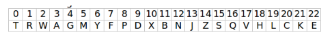

# DNI_kata
Escribe un programa que dado un número de DNI obtenga la letra del NIF. La letra correspondiente a un DNI se calcula mediante el siguiente algoritmo: 
Se obtiene el resto de dividir el número de DNI entre 23. 
El número resultante indica la posición de la letra correspondiente a ese DNI en la siguiente cadena:

**Tabla de asignación**

No se utilizan las letras: I, Ñ, O, U.
La “I” y la “O” se evitan para evitar confusiones con otros caracteres, como “1”, “l” ó “0”.

---

**Hecho por:** [KanekiiKat](https://github.com/KanekiiKat) | [UnTalRubi](https://github.com/UnTalRubi) | [Pistacho14](https://github.com/Pistacho14)
